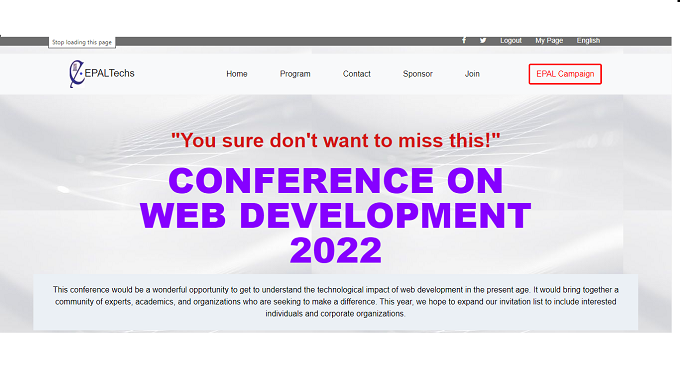

# Emmanuel's Web Conference Pages
​
My first Microverse Capstone Project built with the frameworks and tools available on the web. It is a web conference project where I use modern and world-class methodologies to replicate a web design project.

## Built With
​
- HTML 
- CSS
- JS
- Linters

## Live Demo Link

[Live Video](https://www.loom.com/share/37ab2c84651447159816a99591fbac3f)

[Go Live](https://epaltechs.github.io/)
​
## Getting Started
To get a local copy up and running, follow these simple steps:

- copy this link `https://github.com/Epaltechs/Conference-page`.
- get the directory that you want to clone the repository.
- open the command prompt in this directory.
- write `git clone https://github.com/Epaltechs/Conference-page.`
- go to the repository folder in your command prompt `cd Conference-page`

## 👤 **Author**
## Emmnanuel Paul
- GitHub: [https://github.com/Epaltechs/Epaltechs.github.io]
- LinkedIn: [https://www.linkedin.com/in/emmanuel-paul-a2bab7b4/]
- Twitter: [http://twitter.com/@emmapaul247].
​
## 🤝 Contributor

Contributions, issues, and feature requests are welcome!

Feel free to check the [issues page](https://github.com/Epaltechs/Conference-page/issues).

## Show your support
​
If you like this project you can support just by giving a like.
Emmanuel Paul to Everyone (10:25)

## Acknowledgments
Many thanks to Firdavs Allamurotov and Rwubakwanayo Olivier for your wonderful support. Also, to others in the Microverse community, who in different ways have provided me the support to carry out this project.

Furthermore, I'll like to give credit to Cindy Shin in Behance who created the original design of the web page.
## 📝 License

This project is [MIT](./MIT.md) licensed.
#
